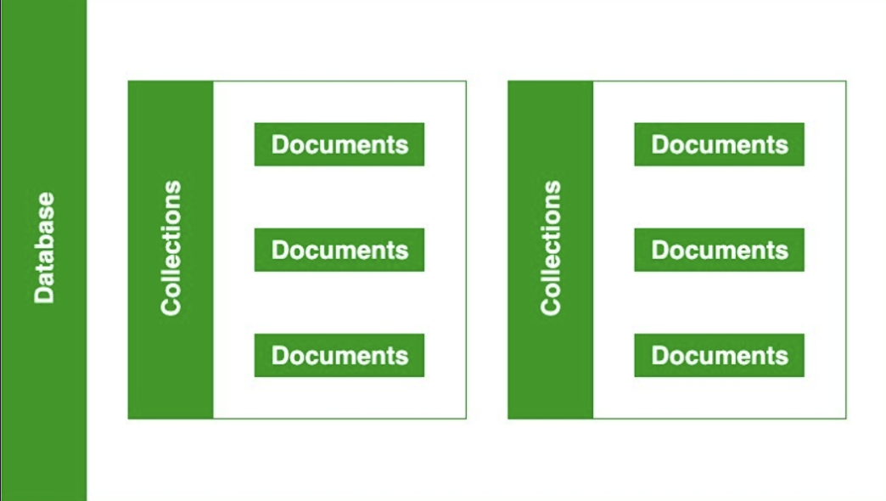

A Database contains a collection, and a collection contains documents and the documents contain data

 
 
Collections:

    • Groups of related documents (like tables in SQL).
 
Documents:

    • MongoDB stores data in documents (JSON-like objects).
     
CRUD Operations:

    • Create, Read, Update, and Delete operations are the core of interacting with the database
 
Syntax:
 
Creating a Database: 

    use officeDatabase;
    
Creating a Collection: 

    db.createCollection("employee");

Inserting a Document:
 
    db.employee.insertOne({
    name: "Alice",
    age: 25,
    skills: ["Python", "MongoDB"]
    });
 
Reading Documents:  

    db.myCollection.find();
 
Updating a Document:
 
    db.myCollection.updateOne(
    { name: "Alice" },
    { $set: { age: 26 } }
    );
    
Deleting a Document: 

    db.myCollection.deleteOne({ name: "Alice" });

