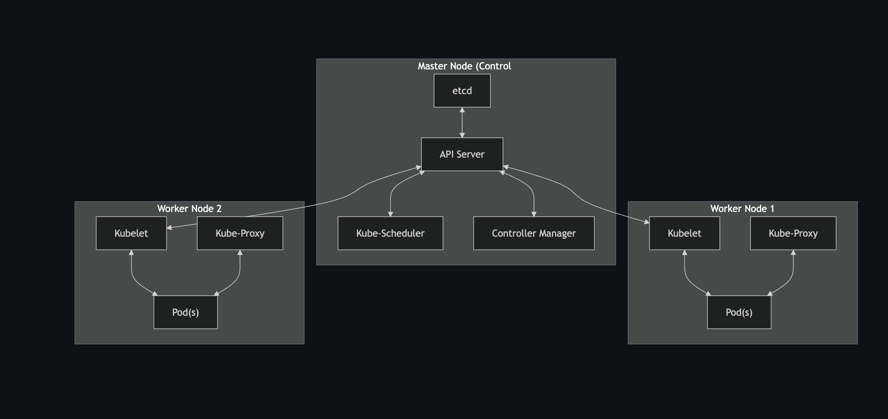

# Kubernetes (K8s) Overview

Kubernetes is an open-source container orchestration platform for automating deployment, scaling, and management of containerized applications.

---

## 📌 Core Components

| **Component**          | **Description**                                                                 |
|-------------------------|---------------------------------------------------------------------------------|
| **etcd**               | Consistent and highly-available key-value store used as Kubernetes' backing store for all cluster data. |
| **API Server**          | Component of the control plane that exposes the Kubernetes API.                 |
| **Kube-Scheduler**      | Assigns nodes to newly created Pods.                                            |
| **Kube-Proxy**          | Maintains network rules on nodes to allow communication inside/outside the cluster. |
| **Controller Manager**  | Runs on the master node; ensures cluster desired state matches actual state.    |
| **Addons**              | Provide additional features like **Deployments** and **DaemonSets**.            |

---

## 📦 Workload APIs

| **Resource**     | **Description**                                                                 | **Example Use Case**   |
|------------------|---------------------------------------------------------------------------------|-------------------------|
| **Deployment**   | Manages replicated applications on the cluster.                                 | Stateless REST API app  |
| **DaemonSet**    | Ensures all (or some) nodes run a copy of a Pod (e.g., monitoring, networking). | Node-level logging agent|
| **StatefulSet**  | Manages stateful applications with persistent identity.                         | Database application    |
| **ReplicaSet**   | Ensures a specified number of replica Pods are running.                         | Scaling web services    |
| **Job**          | Runs Pods until completion.                                                     | Data processing task    |
| **CronJob**      | Creates Jobs on a repeating schedule.                                           | Nightly backups         |

---

## ⚖️ Stateful vs Stateless

- **Stateful**: Stores data and maintains state (e.g., databases like MySQL).  
- **Stateless**: Does not persist data internally (e.g., simple REST API without DB).  

---

## 🌐 Networking in Kubernetes

| **Service Type**     | **Description**                                                                 | **Use Case**                              |
|-----------------------|---------------------------------------------------------------------------------|--------------------------------------------|
| **ClusterIP**        | Default type. Provides internal-only access between Pods in the cluster.        | Pod-to-Pod communication inside cluster.   |
| **NodePort**         | Exposes applications via a static port on each Node. Accessible externally.     | Testing/dev environment exposure.          |
| **LoadBalancer**     | Uses cloud provider's load balancer to distribute external traffic across nodes.| Production-grade external access.          |

- **Ingress**: Manages HTTP/HTTPS external access to services in a cluster.  
- **Egress**: Manages outbound traffic from cluster Pods to external services.  
- **Ingress Controller**: Required to implement Ingress rules.  

---

## 💾 Storage in Kubernetes

| **Resource**               | **Description**                                                                 |
|-----------------------------|---------------------------------------------------------------------------------|
| **Volumes**                 | A directory accessible to containers in a Pod.                                 |
| **Persistent Volume (PV)**  | Cluster-wide storage provisioned by admin or dynamically.                       |
| **Persistent Volume Claim** | Request for PV resources, like Pods requesting CPU/memory.                      |
| **ConfigMaps**              | Store non-confidential configuration data in key-value pairs.                   |

---

## ⚙️ Container Creation (Docker Backend)

When Docker creates a container, the Daemon:  
- Sets up isolated **namespaces** (process, network, etc.).  
- Allocates resources using **cgroups**.  
- Adds a writable layer using **OverlayFS**.  

---

## 🏗️ Kubernetes Architecture

- **Master Node**: Runs control plane components (API server, Controller Manager, Scheduler, etcd).  
- **Worker Node**: Runs Pods via kubelet and kube-proxy.  
- **Communication**:  
  - Worker nodes communicate with master via **API Server**.  
  - Master node controls workers through kubelet and kube-proxy.  

---

## 🚀 Pod Autoscaling Criteria

Pods can auto-scale based on:  
- **CPU utilization**  
- **Memory usage**  
- **Custom metrics** (via Horizontal Pod Autoscaler).  

---

## 📌 Versions

- **Latest Kubernetes Version**: `v1.34` released on Aug 27, 2025.  

---

## 🐳 Docker vs Kubernetes

- **Docker**: Focuses on container creation and runtime.  
- **Kubernetes**: Orchestrates and manages multiple containers across clusters.  
- **VMs vs Containers**:  
  - VMs → Heavyweight, isolated, include full OS.  
  - Containers → Lightweight, share host OS kernel.  

---


## 🏗️ Kubernetes Architecture Diagram




```mermaid
flowchart TB
    subgraph Master["Master Node (Control Plane)"]
        APIServer["API Server"]
        Scheduler["Kube-Scheduler"]
        Controller["Controller Manager"]
        ETCD["etcd"]
    end

    subgraph Worker1["Worker Node 1"]
        Kubelet1["Kubelet"]
        Proxy1["Kube-Proxy"]
        Pod1["Pod(s)"]
    end

    subgraph Worker2["Worker Node 2"]
        Kubelet2["Kubelet"]
        Proxy2["Kube-Proxy"]
        Pod2["Pod(s)"]
    end

    ETCD <--> APIServer
    APIServer <--> Scheduler
    APIServer <--> Controller

    APIServer <--> Kubelet1
    APIServer <--> Kubelet2

    Kubelet1 <--> Pod1
    Kubelet2 <--> Pod2

    Proxy1 <--> Pod1
    Proxy2 <--> Pod2
  ```