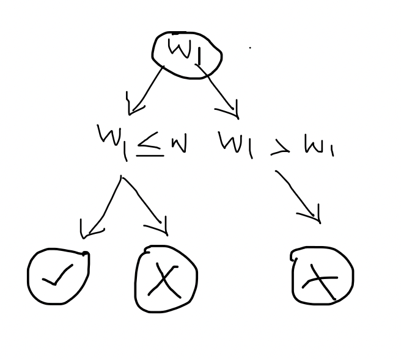

    
Intro to Dynamic Programming - Golang 101

Hi everyone 🤗 , I hope your weekend was fabulous 

So dp 101, is understanding what it entails and when to use it

a problem is considered solvable via dynamic programming if

✅ Overlapping Subproblems: The problem can be broken down into smaller subproblems that are reused multiple times.

✅ Optimal Substructure: The optimal solution to the problem can be constructed from the optimal solutions of its subproblems. This means that solving smaller instances of the problem helps build the solution to the larger problem.

in other words, a problem that requires a combination of inputs or requires the most optimal solution is likely a DP candidate.

so how do we go about it?

1️⃣ Define the function objective.

2️⃣ Define base cases.

3️⃣ Write down the recurrence relation for the optimized objective function

4️⃣ Order of execution(bottom up/top bottom)

5️⃣ Where to look for the answer.

Understanding how dp works is good because it is elegant and resourceful.
    

    
    • DP is enhanced recursion

    • Identification:

        a. Choice : knapsack problem (include element or not) (2 function call)
        b. Optimal asked (minimum , maximum, largest, greatest etc. values)

    • 2 Ways to solve recursion
    
        a. Recursive -> memoize       b)  Recursive -> top down

    • Type of DP problems:
        ○ 0-1 knapsack: Items can be included as a whole or nothing, (no fractional or repeated item allowed)
            1. Subset sum
            2. Equal sum partition
            3. Count of subset sum with a given sum
            4. Minimum subset sum difference
            5. Count the number of subset with a given difference
            6. Target sum
        ○ Unbounded knapsack: Unlimited supply of items, can be included multiple times or repeated times.
        ○ Fibonacci
                1. Fibonacci numbers
                2. Staircase/climbing stairs
                3. Number factors
                4. Minimum jumps to reach the end
                5. Minimum jumps with fee
                6. House thief
        ○ LCS
        ○ LIS
        ○ DP on grid
        ○ Matrix chain multiplication

    • Example:
    Wt[]: 1 , 3 ,4 , 5
    Val[]: 1, 4 ,5 , 7
    W 7 KG
    Output: maximum profit ?

Choice Diagram:
    

Memoization technique :
    
    
    
Problems:

0-1 knapsack:

    1. 0/1 Knapsack Problem
Given weights and values of n items, determine the maximum value that can be put in a knapsack of capacity W. 
    2. Subset Sum Problem
Determine if there's a subset of the given set with a sum equal to a given sum. This is a special case of the 0-1 Knapsack problem.
    3. Partition Equal Subset Sum
Check if the array can be partitioned into two subsets with equal sums.
    4. Count of Subsets with Given Sum
Count the number of subsets that sum up to a given value.
    5. Printing Items in 0/1 Knapsack
Beyond computing the maximum value, print the items included in the knapsack for the optimal solution.
    6. Target Sum

Fibonacci:

    1. Fibonacci Number
Compute the nth Fibonacci number efficiently using DP techniques. 
    2. Climbing Stairs
Given n stairs, each time you can climb 1 or 2 steps. Count the number of distinct ways to reach the top.
    3. House Robber
Given a list of non-negative integers representing the amount of money of each house, determine the maximum amount you can rob without alerting the police (i.e., without robbing two adjacent houses).
    4. Decode Ways
Given a string containing only digits, determine the total number of ways to decode it. This problem maps to Fibonacci when considering the number of ways to decode sequences.
    5. Nth Tribonacci Number
Similar to Fibonacci, but each term is the sum of the preceding three terms.

Unbounded knapsack

    1. Unbounded Knapsack Problem
Given a set of items with infinite supply, determine the maximum value achievable within the knapsack capacity. 
    2. Coin Change (Number of Ways)
Given coins of different denominations and a total amount, compute the number of combinations to make up that amount.
    3. Coin Change (Minimum Coins)
Given coins of different denominations and a total amount, find the minimum number of coins needed to make up that amount.
    4. Rod Cutting Problem
Given a rod of length n and prices for different lengths, determine the maximum total value obtainable by cutting up the rod and selling the pieces.
    5. Integer Break
Given a positive integer n, break it into the sum of at least two positive integers and maximize the product of those integers.