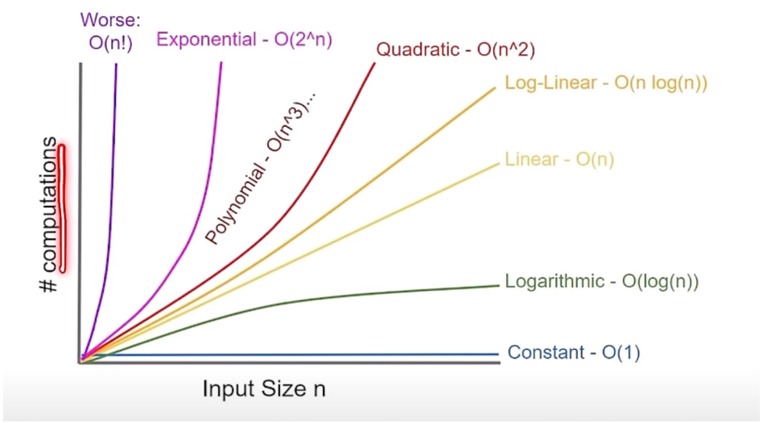
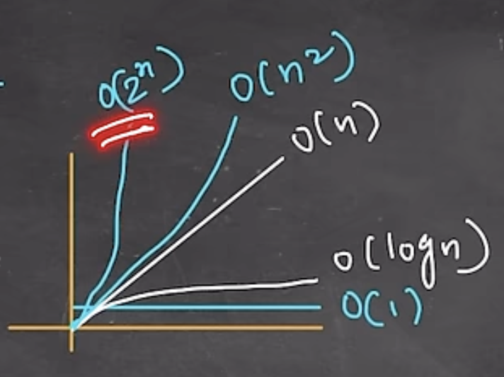

    1. O(1)
        a. Best time complexity
    2. O(log n) 
        a. Searching (binary search)
    3. O(n)
        a. For loop (visiting all elements)         
    4. O(n log n)
        a. Sorting
    5. O(n^2)
        a.  nested for loop
    6. O(2^n)
        a. Recursion ( Use DP to improve time complexity )

Note: addition of time complexities, we consider dominant time complexity.

O(1) 
O(log n) = binary search

O(n) = for loop

O(n log n) = sorting

O(n^2) = nested for loop

O(2^n) = Recurrsion  => (use DP to improve time complexity typically to polynomial (O(n), O(n^2))

