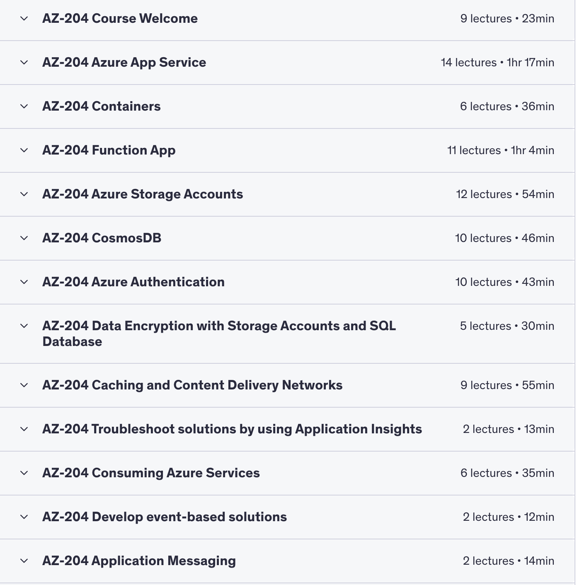

# 🚀 AZ-204: 21-Day Study Plan

## 🎯 Goal
- **Duration:** 21 days  
- **Daily Time:** 2 hours  
- **Outcome:** Solid understanding of core topics, hands-on practice, and readiness for **AZ-204 Certification**  

---

## 📚 Tools & Resources
- [Microsoft Learn - AZ-204 Learning Path](https://learn.microsoft.com/en-us/certifications/exams/az-204/)  
- [Azure Free Account](https://azure.microsoft.com/en-us/free)  
- YouTube: *Programming with Guru* / *freeCodeCamp AZ-204*  
- (Optional) Whizlabs / MeasureUp mock tests  

---

## 🗓️ 21-Day Study Plan

### **Week 1: Compute + Deployment (Core Backend Topics)**

| Day | Topics | Tasks |
|-----|--------|-------|
| 1 | Intro to Azure + App Services | Microsoft Learn module + deploy simple app |
| 2 | Azure App Services (deep dive) | Auth, deployment slots, configs |
| 3 | Azure Functions | Triggers, bindings, code a basic function |
| 4 | Azure Container Instances + AKS (intro) | Understand Docker → ACI/AKS deployment flow |
| 5 | Azure CLI, ARM templates, Bicep (intro) | Deploy resources via CLI |
| 6 | REST API integration in Azure | Practice exposing a basic REST service |
| 7 | **Weekly Review + Quiz** | Use Microsoft Learn quizzes or YouTube review |

---

### **Week 2: Storage, Security, Integration**

| Day | Topics | Tasks |
|-----|--------|-------|
| 8 | Azure Blob, Queue, Table Storage | Upload, access blobs from CLI/Portal |
| 9 | Azure Cosmos DB | Query data via emulator or free tier |
| 10 | Azure SQL (overview) | Access, firewall rules, basic CRUD |
| 11 | Authentication: Azure AD, OAuth, RBAC | Implement RBAC on an App Service |
| 12 | Azure Key Vault + Managed Identity | Create secret, access in function/app |
| 13 | Azure Service Bus + Event Grid | Push & receive events; use Learn labs |
| 14 | **Weekly Review + Mini Mock Test** | Whizlabs free test or other source |

---

### **Week 3: Monitoring, Deployment, Exam Prep**

| Day | Topics | Tasks |
|-----|--------|-------|
| 15 | App Insights + Log Analytics | Enable logs for App Services |
| 16 | Azure Monitor + Diagnostics | Set up alerts, check metrics |
| 17 | CI/CD with GitHub Actions + Azure DevOps | Deploy to Azure from GitHub |
| 18 | Exception Handling, Retry Policies | Implement error & resilience |
| 19 | Final Review Day | Revise weak topics + 1–2 hr revision video |
| 20 | Full-Length Mock Test #1 | Review answers carefully |
| 21 | Full-Length Mock Test #2 + Strategy | Final tips, checklist, exam strategy |

---

## ✅ Pro Tips
- Spend **10 mins** reviewing the previous day’s topic before moving on.  
- Keep a **Google Doc / Notion page** for notes & Azure CLI commands.  
- Build **2–3 small hands-on projects**:
  - REST API on Azure App Service + Blob Storage  
  - Azure Function triggered by Event Grid storing data in Cosmos DB  

---

## Categorize the AZ-204 services:

Compute:

    Azure App Service Web Apps
    Azure Container Instances
    Azure Container Apps
    Azure Functions

Storage:

    Azure Blob Storage
    Azure Cosmos DB
    Azure Queue Storage

Network:

    Azure API Management
    Azure Service Bus
    Azure Event Grid
    Azure Event Hubs

# ☁️ AZ-204: Developing Solutions for Microsoft Azure  
**21-Day Structured Study Plan + Exam Skills Breakdown**

---

## 🎯 Exam Skills Measured

### 1. Develop Azure Compute Solutions (25–30%)  
- **Azure App Service Web Apps**
  - Create an Azure App Service Web App  
  - Configure and implement diagnostics and logging  
  - Deploy code and containerized solutions  
  - Configure settings (TLS, API settings, service connections)  
  - Implement autoscaling  
  - Configure deployment slots  

- **Containerized Solutions**
  - Create and manage container images  
  - Publish an image to Azure Container Registry (ACR)  
  - Run containers using Azure Container Instance (ACI)  
  - Create solutions using Azure Container Apps  

- **Azure Functions**
  - Create and configure Functions apps  
  - Implement input and output bindings  
  - Implement triggers (data operations, timers, webhooks)  

---

### 2. Develop for Azure Storage (15–20%)  
- **Cosmos DB**
  - Perform CRUD operations with SDK  
  - Configure consistency levels  
  - Implement change feed notifications  

- **Blob Storage**
  - Set/retrieve properties & metadata  
  - Perform operations with SDK  
  - Implement lifecycle management policies  

---

### 3. Implement Azure Security (15–20%)  
- **User Authentication & Authorization**
  - Microsoft Identity platform (OAuth, OIDC)  
  - Microsoft Entra ID (formerly Azure AD)  
  - Shared Access Signatures (SAS)  
  - Integrate with Microsoft Graph  

- **Secure Solutions**
  - Secure configuration data with App Configuration or Key Vault  
  - Use keys, secrets, and certificates from Key Vault  
  - Implement Managed Identities for resources  

---

### 4. Monitor & Troubleshoot (5–10%)  
- **Application Insights**
  - Monitor metrics, logs, traces  
  - Implement web tests & alerts  
  - Instrument apps/services for telemetry  

---

### 5. Connect to & Consume Services (20–25%)  
- **API Management**
  - Create & document APIs  
  - Configure access & apply policies  

- **Event-based Solutions**
  - Implement Event Grid-based workflows  
  - Implement Event Hub-based data streaming  

- **Message-based Solutions**
  - Implement Service Bus messaging  
  - Implement Queue Storage jobs/tasks  

---

## 📚 References
- [Azure Container Registry](https://learn.microsoft.com/azure/container-registry/)  
- [Azure Container Instances](https://learn.microsoft.com/azure/container-instances/)  
- [Azure App Service](https://learn.microsoft.com/azure/app-service/)  
- [Azure Functions](https://learn.microsoft.com/azure/azure-functions/)  
- [Azure Cosmos DB](https://learn.microsoft.com/azure/cosmos-db/)  
- [Azure Blob Storage](https://learn.microsoft.com/azure/storage/blobs/)  
- [Microsoft Entra ID](https://learn.microsoft.com/entra/)  
- [Azure Key Vault](https://learn.microsoft.com/azure/key-vault/)  
- [API Management](https://learn.microsoft.com/azure/api-management/)  
- [Azure Event Hubs](https://learn.microsoft.com/azure/event-hubs/)  
- [Azure Event Grid](https://learn.microsoft.com/azure/event-grid/)  
- [Azure Service Bus](https://learn.microsoft.com/azure/service-bus-messaging/)  
- [Azure Queue Storage](https://learn.microsoft.com/azure/storage/queues/)  

---

## 🗓️ 21-Day Study Plan  

### **Week 1: Azure Compute + Azure Storage (45–50%)**  
**Day 1–3: Containerized Solutions**  
- ✅ Learn Docker basics  
- 🔹 Create & manage container images  
- 🔹 Push to ACR  
- 🔹 Run with ACI & Azure Container Apps  
- 🔍 Ref: Container Registry, Container Instances  

**Day 4–6: Azure App Service Web Apps**  
- ✅ Create App Service Web Apps  
- 🔹 Deploy code & containers  
- 🔹 Enable logging, configure TLS, API settings  
- 🔹 Implement autoscaling & deployment slots  
- 🔍 Ref: App Service  

**Day 7: Azure Functions**  
- ✅ Create Functions (Timer, HTTP, Event)  
- 🔹 Use bindings (input/output)  
- 🔹 Implement triggers (timer, data ops, webhooks)  
- 🔍 Ref: Azure Functions  

---

### **Week 2: Azure Storage + Security (30–40%)**  
**Day 8–9: Cosmos DB**  
- ✅ CRUD operations with SDK  
- 🔹 Configure consistency levels  
- 🔹 Implement change feed notifications  
- 🔍 Ref: Cosmos DB  

**Day 10–11: Blob Storage**  
- ✅ Read/write with SDK  
- 🔹 Retrieve metadata/properties  
- 🔹 Lifecycle management policies  
- 🔍 Ref: Blob Storage  

**Day 12–13: Identity & Authorization**  
- ✅ Microsoft Identity Platform  
- 🔹 Microsoft Entra ID (Azure AD)  
- 🔹 Shared Access Signatures  
- 🔹 Microsoft Graph integration  
- 🔍 Ref: Entra ID  

**Day 14: Secure Solutions**  
- ✅ App Configuration & Key Vault  
- 🔹 Managed Identities  
- 🔍 Ref: Azure Key Vault  

---

### **Week 3: Monitoring + APIs + Messaging/Event Solutions (30–35%)**  
**Day 15: Application Insights**  
- ✅ Add monitoring to apps  
- 🔹 Enable metrics/logs/traces  
- 🔹 Alerts & web tests  
- 🔍 Ref: Application Insights  

**Day 16–17: API Management**  
- ✅ Create API Management instance  
- 🔹 Publish & document APIs  
- 🔹 Configure access & policies  
- 🔍 Ref: API Management  

**Day 18: Event Grid & Event Hub**  
- ✅ Event-driven architecture  
- 🔹 Trigger Functions with Event Grid  
- 🔹 Send/receive events via Event Hub  
- 🔍 Ref: Event Grid, Event Hub  

**Day 19: Service Bus & Queue Storage**  
- ✅ Service Bus for messaging  
- 🔹 Queue Storage for background tasks  
- 🔍 Ref: Service Bus, Queue Storage  

---

### **Final Days: Review & Mock Exams**  
**Day 20: Quick Revision**  
- ✅ Review all modules  
- 🔹 Go over docs & notes  

**Day 21: Full Mock Exam**  
- ✅ Take full-length practice test  
- 🔹 Focus on weak areas, revisit modules  

---

## ✅ Pro Tips
- Review previous day’s topic for **10 mins** before starting new ones  
- Maintain notes in **Google Docs/Notion** with CLI commands  
- Build **2–3 small projects** for practice:
  - REST API on Azure App Service + Blob Storage  
  - Azure Function triggered by Event Grid → Cosmos DB storage  
  - Containerized app deployed via ACR + ACI  

---
