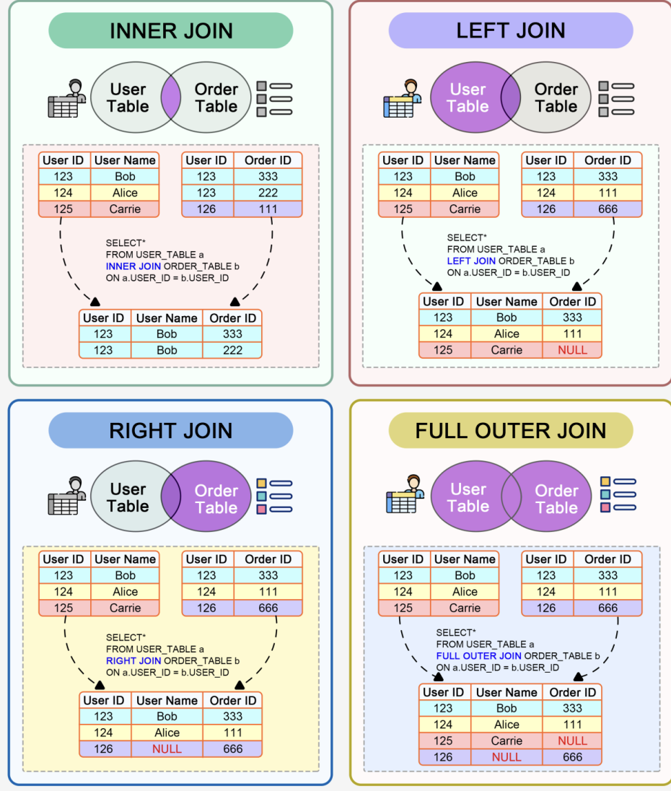

## 1. Relational Dbms vs non relational Dbms / How to decide which database to use (relational vs non relational)
    
Here’s a summary of the SQL vs NoSQL comparison in a tabular format:
    
### SQL vs NoSQL Comparison

This document provides a structured comparison between **SQL (Relational DBMS)** and **NoSQL (Non-Relational DBMS)**.

---

### 📊 Comparison Table

| **Criteria**                  | **SQL (Relational DBMS)**                                             | **NoSQL (Non-Relational DBMS)**                                       |
|-------------------------------|----------------------------------------------------------------------|----------------------------------------------------------------------|
| **Data Structure**            | Structured, predefined schema                                        | Unstructured, flexible schema                                        |
| **Data Relationships**        | Complex relationships, normalized data                              | Simple or no relationships, denormalized data                        |
| **Transaction Support**       | Strong ACID compliance                                               | BASE model (Eventual consistency, High availability)                 |
| **Scalability**               | Vertical scaling (scaling up with more resources)                   | Horizontal scaling (distributing data across servers)                 |
| **Performance**               | Slower for large-scale data due to joins and relationships          | Faster for high read/write throughput, low-latency operations        |
| **Use Case**                  | Structured data, financial systems, ERP, CRM                        | Big Data, real-time analytics, social networks, CMS                  |
| **Flexibility**               | Schema is rigid, harder to change                                   | Schema is flexible, can easily modify structure                      |
| **Data Volume & Velocity**    | Suitable for moderate data volume and velocity                      | Ideal for handling large-scale data and real-time ingestion          |
| **Cost**                      | Higher licensing and maintenance costs                              | Lower cost, open-source options available                            |
| **Query Complexity**          | Supports complex queries with joins                                 | Less suited for complex queries (depends on NoSQL type)              |
| **Consistency**               | Strong consistency                                                  | Eventual consistency (depends on NoSQL type)                         |
| **Development Speed**         | Slower development due to fixed schema                              | Faster development with schema flexibility                           |

---

## ✅ Summary

- **SQL** is best suited for applications requiring **structured data, strong consistency, and complex relationships** such as **financial systems, ERP, and CRM**.  
- **NoSQL** is ideal for **large-scale, high-velocity, and flexible schema needs**, such as **big data, real-time analytics, and social networks**.  


    
## 2. Types of SQL commands:
        a. DDL : Data definition language
            Ex: create, alter, rename, truncate and drop
        b. DQL: Data Query Language
            Ex: select
        c. DML: Data manipulation language
            Ex: Insert , update, delete
        d. DCL and TCL : Data and Transaction Control Language
        
## 3. Keys:
        a. Primary Key: it uniquely identifies each row in table ex. Roll no.
        b. Foreign Key: it is the PK of some other table 
        
## 4. SQL Joins:

        a. INNER JOIN Returns matching rows in both tables. 
        b. LEFT JOIN Returns all records from the left table, and the matching records from the right table. 
        c. RIGHT JOIN Returns all records from the right table, and the matching records from the left table. 
        d. FULL OUTER JOIN Returns all records where there is a match in either the left or right table. 
        e. 



    5. ACID Properties:
        a. Atomicity
        b. Consistency
        c. Isolation
        d. Durability


## Query Examples:

    1. LIKE
        Q:Show first name of patients that start with the letter 'C'
        Soln: 
        SELECT first_name 
        FROM patients
        where first_name like 'C%'
        
    2. BETWEEN
        Q: Show first name and last name of patients that weight within the range of 100 to 120 (inclusive)
        Soln: 
        SELECT first_name,last_name FROM patients
        where weight between 100 and 120
        
    3. COUNT
        Q: Show how many patients have a birth_date with 2010 as the birth year.
        Soln:
        select count(*) from patients
        where year(birth_date)=2010
        
    4. DISTINCT: 
    use distinct keyword for distinct data
    Ex: select distinct city from country; 
        
        
## Practice:

createdb testdb       	 # create a test database
psql testdb                	 # open the SQL shell
CREATE TABLE users (id SERIAL PRIMARY KEY, name TEXT, age INT);	
INSERT INTO users (name, age) VALUES ('Anshul', 30);
SELECT * FROM users;

Exit with \q


## Interview Questions:

1. A SQL query to fetch the second largest number from a table: `Using LIMIT and OFFSET (MySQL, PostgreSQL)`

```sql
    SELECT column_name 
    FROM table_name 
    ORDER BY column_name DESC 
    LIMIT 1 OFFSET 1;
```