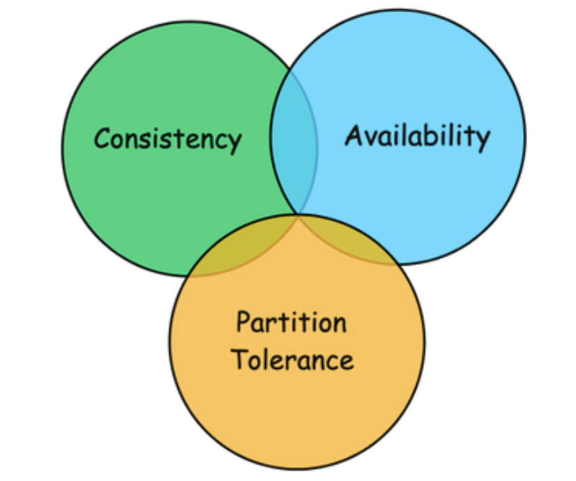

- A. guarantee all three of the desirable properties – 
        Consistency, Availability, and Partition Tolerance at the same time in a distributed system

- B. Consistency means that all the nodes (databases) inside a network will have the same copies of a replicated data item visible for various transactions.

- C. Availability means that each read or write request for a data item will either be processed successfully or will receive a message that the operation cannot be completed.

- D. Partition tolerance means that the system can continue operating even if the network connecting the nodes has a fault that results in two or more partitions, where the nodes in each partition can only communicate among each other.

The CAP theorem states that it is impossible to achieve all three properties simultaneously:

    1. Consistency (C): All nodes always have the same data.

    2. Availability (A): Every request receives a response, regardless of failure.
    
    3. Partition Tolerance (P): The system works even when partitions exist.