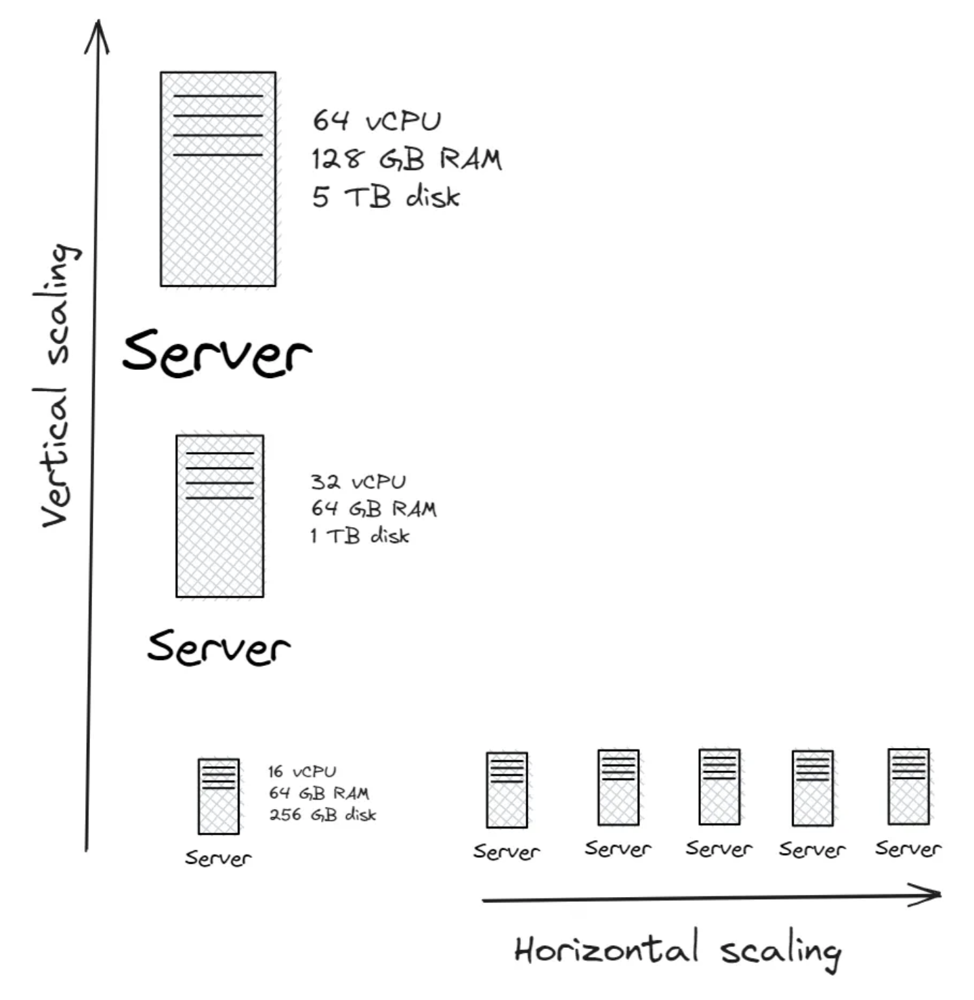

Vertical Scaling:
    Increasing server capacity
    refers to high computational requirements
    Less complicated maintenance

Horizontal Scaling:
    Increasing servers
    refers to high availability
    Less complicated maintenance
    Less downtime

    
A system that can continuously evolve to support a growing amount of work is scalable.

